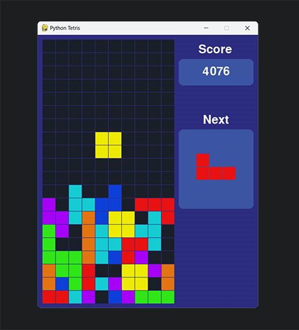

# Tetris_Game :joystick:




Embark on a nostalgic journey while building the classic Tetris game using the programming language Python and it's Pygame library! 

The Pygame library gifts this Tetris game various functions for its graphics, audio, and input handling. 

Installing Pygame: 
```
pip install pygame-ce 
```

Receiving confirmation that it was successfully installed should render in your terminal:
```
Successfully installed pygame-ce-2.5.1 
```

Start using and initialize Pygame writing the following within `main.py`:
```
pygame.init()
```

## Set up the Game Structure  
Definitions:
- [ ] Defining the variables needed
- [ ] Creating the game objects 

Game Loop:
- [ ] Updating the positions of the game objects
- [ ] Checking for collisions 
- [ ] Consists of 3 steps: 

1. Event Handling -
    - Check for any events that occur in the game = quitting the game, a key pressed on the keyboard, etc. Using the Pygame event handling system. 

2. Updating Positions -
    - Update the positions of all the game objects (the blocks) based on the events we detected in Step 1 Event Handling. 

3. Drawing Objects -
    - Draw all the game objects in their new positions on the screen. Using the Pygame graphics functions to render the objects in the display. 

**By following 3 steps, we can create a dynamic and interactive game that responds to user inputs and updates its state accordingly.**


Game Window: (Display Surface) - 
    - Create the blank canvas to draw our game objects by using -> screen = pygame.display.set_mode((300, 600))
    - Set Mode method takes a tuple as an argument ((width, height))

Coordinate Systems to draw on the display surface - 
    - Computer Graphics - The origin of display is located at the top left corner (0, 0)
    - X Coordinate increases as we move to the RIGHT (X, 0)
    - Y Coordinate increases as we move DOWN (0, Y)

Set the Game Title using:
```
pygame.display.set_caption('Python Tetris Game')
```

Create a clock object using:
```
clock = pygame.time.Clock() 
```

**Make sure Clock has a capital C to control the frame rate of the game - _"How fast the game will run"_**


